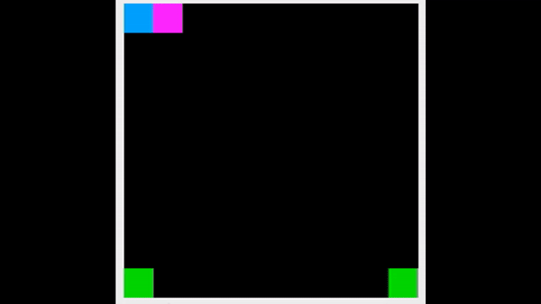
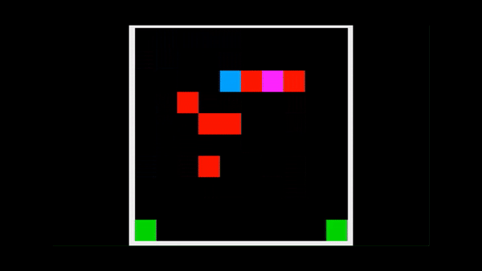
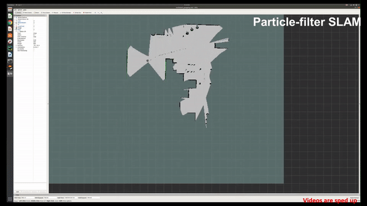
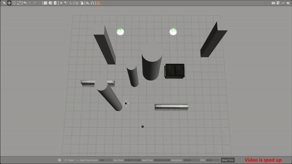
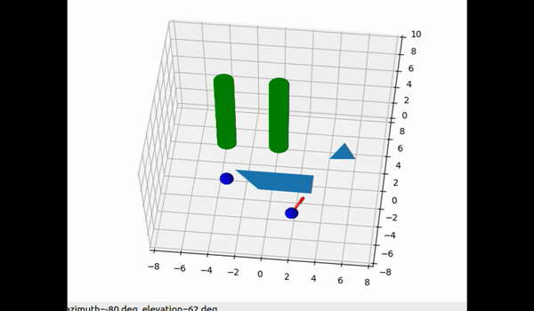
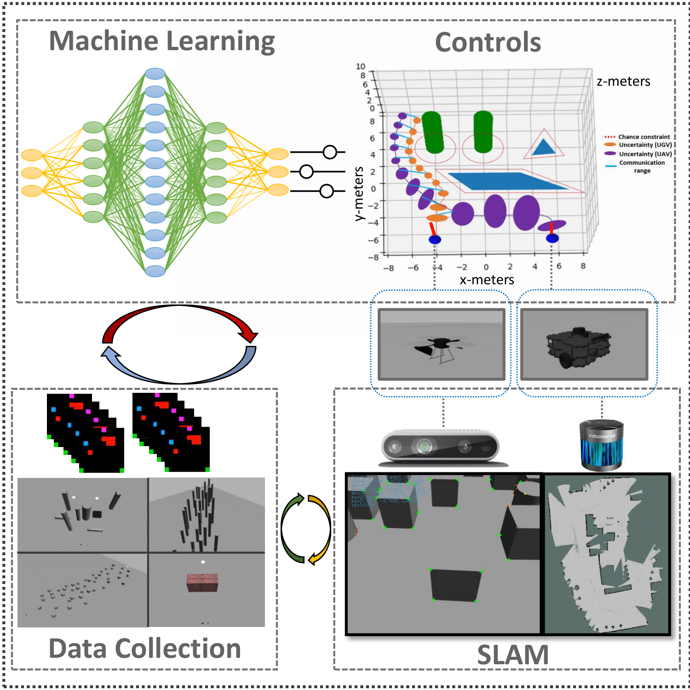

# SABER
This is the SABER submodule, part of the overall SABER project. To run the SABER project and install the necessary dependencies and packages, please go to the [SABER_build repository](https://github.com/stephanietsuei/SABER_build) and follow its instrunctions included in the README.

The work is currently under review, and use of this code is permitted but requires citation.

## SABER: Data-Driven Motion Planner for Autonomously Navigating Heterogeneous Robots
`Authors: Alexander Schperberg, Stephanie Tsuei, Stefano Soatto, and Dennis Hong.`
## Dependencies (pip install ~), tested and run on python 2.7
1. `numpy`
2. `pandas`
3. `gym`
4. `torch`
5. `matplotlib`
6. `collections`
7. `random`
8. `casadi`
9. `mpl_toolkits`
10. `control`
11. `tensorflow`
12. `sklearn`
## SABER: Stochastic model predictive control and Autonomous Bots in uncertain Environments using Reinforcement learning

